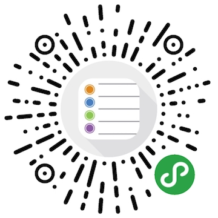
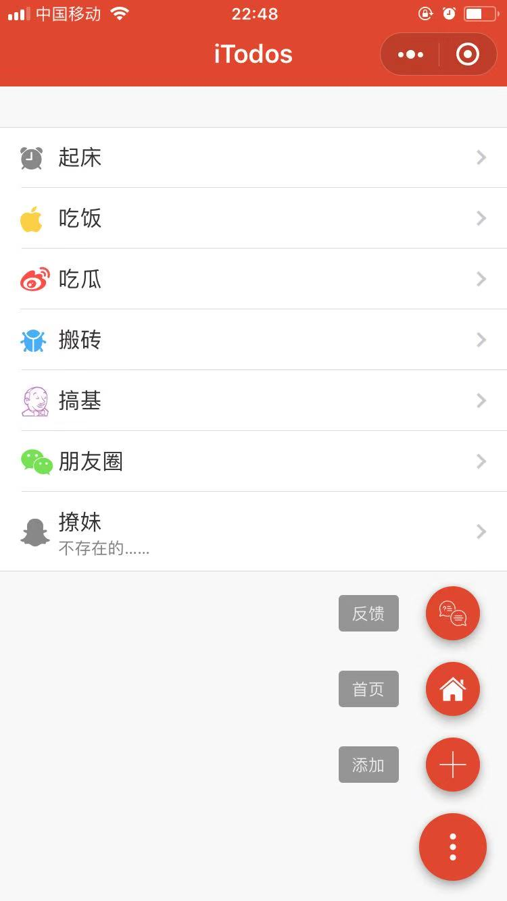
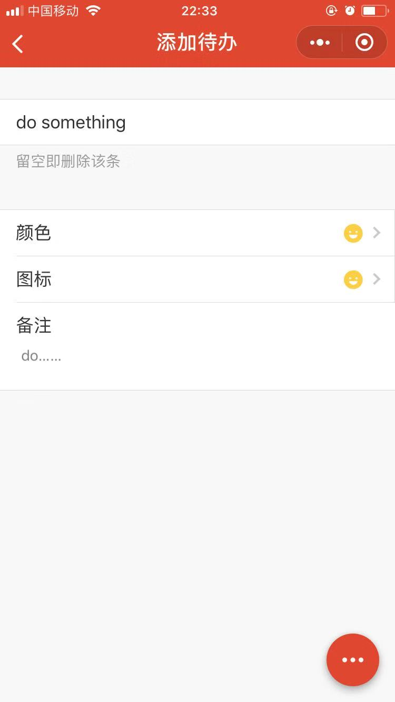

# iTodos

☁️ 小程序·云开发版TodoList - iTodos 📌

# Screenshots

# Deploy

- 替换 `project.config.json` 中的 `appid` 为你的小程序应用ID
- 替换 `gulpfile.js` 中的 `cloudEnv` 为你的小程序对应的云开发环境ID
- 执行 `npm install` 安装依赖，执行 `NODE_ENV=production gulp` 构建
- 微信开发者工具预览上传
- Enjoy

# License

MIT
